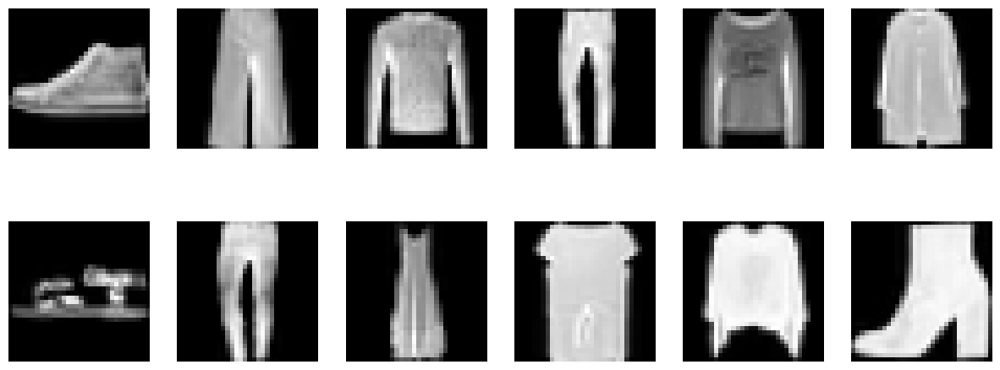
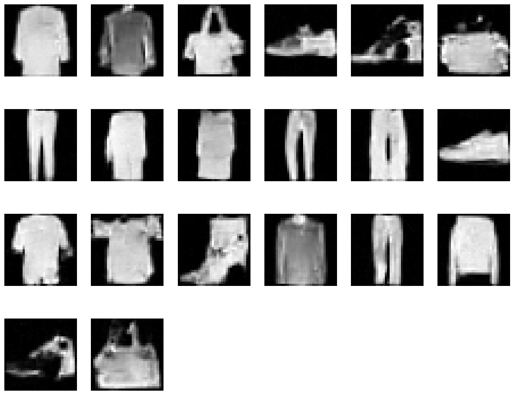

# Fashionable Diffusion

Welcome to "Fashionable Diffusion," a repository showcasing my first venture into the world of diffusion models. This project is born from a desire to explore a stable and relatively easier-to-train alternative to Generative Adversarial Networks (GANs). In the past, I've done Wasserstein GANs (which is already a big improvement to DCGAN etc) but diffusion models seem even more stable.

## Introduction

I've previously worked with training GANs, which can be quite a handful - unpredictable and often challenging. That's why I decided to explore diffusion models. They're gaining a lot of buzz for being more stable during training, making them a good pick for both beginners and those with more experience. They definitely make the training process more approachable, though it's worth mentioning that this ease comes at the expense of longer times for generating images.

## Results

### Data from Fashion MNIST

### Generated Data

*Note: The inference time for generating 10 images in parallel is approximately 15 seconds. Parallel generation is recommended to optimize the process.*

## Sources

This project was inspired by and based on principles from the following papers and video resources:

1. ["Deep Unsupervised Learning using Nonequilibrium Thermodynamics"](https://arxiv.org/abs/1503.03585)
2. ["Denoising Diffusion Probabilistic Models"](https://arxiv.org/abs/2006.11239)

Additional Resources (nice youtube explanations and PyTorch tutorials):
- [The math behind diffusion](https://www.youtube.com/watch?v=HoKDTa5jHvg)
- [The code behind diffusion](https://www.youtube.com/watch?v=a4Yfz2FxXiY)
